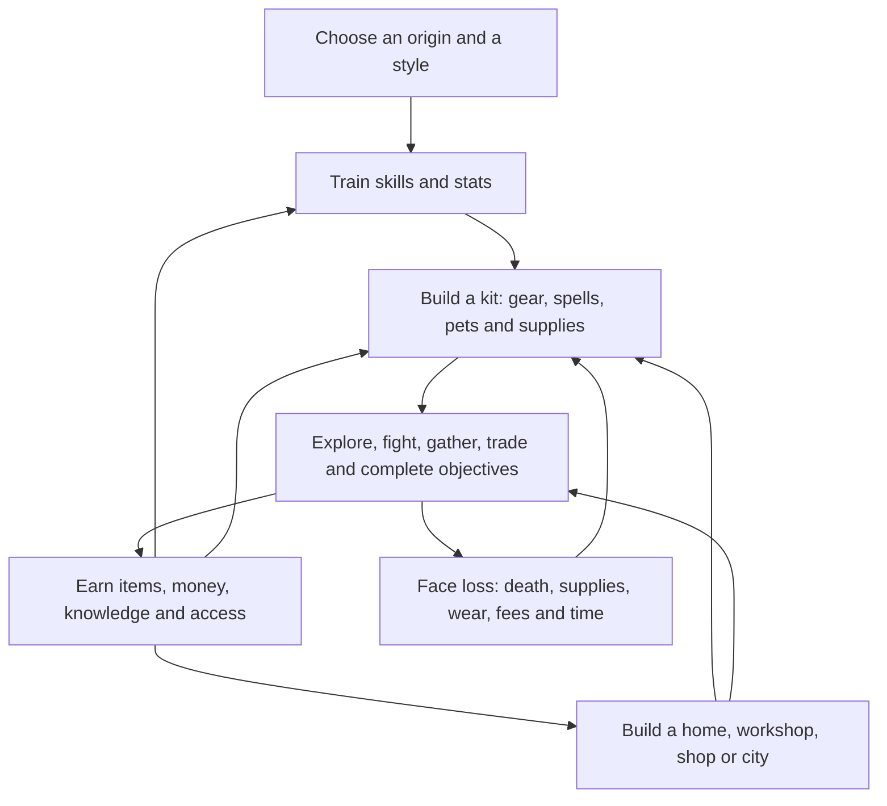

# Understanding Confictura

## Start here

Confictura is a game about **building a capable character, learning a large world, and turning discoveries into lasting advantages**. Skills, equipment, pets, magic, wealth, and access to places all contribute. Its displayed level captures only part of that strength.

This guide explains the current game before proposing a rebalance. The direction you chose is to preserve **lasting power, mastery, and discovery**. None of the tuning ideas here is an approved change.

**Study date:** September 27, 2026. **Source baseline:** `6568058a` on `main`. Game code, settings, saved characters, item properties, spawns, and rewards were not changed by this study.

### Read in this order

| Time / question | Read |
| --- | --- |
| Five minutes: what is this game rewarding? | Continue down this page. |
| What does each system do? | [Systems at a glance](systems-at-a-glance.md) |
| What makes a character stronger? | [Character and progression](character-and-progression.md) |
| How does a fight actually work? | [Combat, equipment, magic, and pets](combat-and-builds.md) |
| What is there to do and earn? | [Adventure, rewards, production, and society](adventure-and-economy.md) |
| How do travel, exploration, and world rules work? | [World and exploration](world-and-exploration.md) |
| How do the systems compound or clash? | [Connections and balance questions](connections-and-balance.md) |
| How could we rebalance without losing the spirit? | [Balance research plan](balance-research-plan.md) |
| How much has actually been verified? | [Coverage and evidence](coverage-and-evidence.md) |

## The game in one picture

This is a conceptual summary of the traced systems, not a literal XP pipeline. The chapters identify each actual conversion and its exceptions.

### There are several kinds of progress

| Kind | What it feels like | Examples in this game | Why it matters to balance |
| --- | --- | --- | --- |
| Lasting power | “My character can do more than before.” | Base skills, stat caps, leveled equipment, trained pets, persistent race benefits. | Changes what content the player can defeat. |
| Breadth | “I have another answer to this problem.” | Extra skills, schools, damage types, crafted tools, travel options. | Can remove weaknesses even without increasing one damage number. |
| Mastery | “I know how to use what I have.” | Target choice, timing, retreat, resource management, pet control, equipment choice. | Gives skilled play room to matter. Actual player skill is not measured by source code. |
| Discovery | “I found a place, route, recipe, clue, or interaction.” | Hidden chests, quests, region access, research magic, ocean expeditions. | Rewards knowledge and exploration; repeated optimal routes can eventually replace discovery. |
| Economic reach | “I can afford or supply more attempts.” | Gold, vendors, crafting materials, storage, production, city resources. | Turns into power through equipment, consumables, and reduced downtime. |
| Expression and belonging | “This is my character and my place.” | Titles, houses, decoration, books, guilds, government, stories. | Provides lasting goals that do not require endlessly larger combat numbers. |

## Six findings that change how to think about balance

1. **A level is a summary, not a full power budget.** The 1–100 rating is derived from skills, stats, and reputation. Equipment improvements and some beyond-100 skill strength are poorly represented. Compare builds and outcomes as well as level. See [progression](character-and-progression.md).
2. **Power can pay for more power.** Damage, leech, kill rewards, and equipment XP connect. A stronger player can sometimes fight longer as well as kill faster. See [combat](combat-and-builds.md) and [connections](connections-and-balance.md).
3. **The same investment has different ceilings.** Origins have different total skill caps; special progression, races, spell exclusions, and follower requirements create other thresholds. Ten more points do not always have the same value. See [progression](character-and-progression.md).
4. **Rewards follow different rules.** Global gold scaling reaches many rewards, while some payouts follow their own paths. Treasure, champions, nests, ordinary kills, and production need separate accounting. See [adventure and economy](adventure-and-economy.md).
5. **Convenience changes earning speed.** Storage, low vendor carrying costs, offline study, travel, and reduced equipment wear affect the number and cost of attempts. They deserve measurement alongside damage and drop rates. See [balance research](balance-research-plan.md).
6. **Balance has been considered in individual systems.** Caps, magic exclusions, creature profiles, reward rules, and a dedicated mobile balance catalog demonstrate that. The current evidence does not establish a coherent balance target across the whole game. The useful next step is to define that target and measure the connected systems.

## Effort is part of the identity; repetition is only one form of effort

An earned upgrade can come from a difficult fight, a long collection, a clever build, a dangerous expedition, a productive business, or a discovery. The concern to investigate is whether one repetitive, low-risk activity buys so much general power that it crowds out the others.

The design question is: **What should a veteran be able to do that a newcomer cannot, and what should still require skill, preparation, or cooperation?** We do not need to answer that by deleting earned progress. We do need to choose a desired power gap, a role for each activity, and a way for newer players to participate.

## What the evidence does and does not tell us

- **Source fact:** the current code contains and connects a rule. Exact files, symbols, and line ranges are in the chapters and linked review reports.
- **Checked-in setting:** the repository selects a value or mode. Deployment may differ.
- **Derived example:** arithmetic from a stated formula or an explicitly simplified model.
- **Balance hypothesis:** a plausible effect on play that needs observation.
- **Unknown:** current character builds, item supply, prices, playtime, encounter frequency, or a content path not yet traced deeply enough.

The full source census is indexed. Shared mechanics and the major gameplay families receive detailed review. Individual spells, creatures, recipes, quests, and saved-world placements have different levels of review; [coverage](coverage-and-evidence.md) states those limits. File counts are not a claim that every item is balanced or every live path has been tested.

## Source trace

Start with `CharacterLevelService.GetOverallLevel` in [CharacterLevelService.cs](../../Data/Scripts/Custom/Progression/CharacterLevel/CharacterLevelService.cs), `BaseWeapon` in [BaseWeapon.cs](../../Data/Scripts/Items/Weapons/BaseWeapon.cs), `MyServerSettings` in [Settings.cs](../../Data/Scripts/System/Misc/Settings.cs), and `MobileBalanceCatalog.ApplyProfile` / `DropLoot` in [MobileBalanceCatalog.cs](../../Data/Scripts/Custom/PvE/MobileBalance/MobileBalanceCatalog.cs). The detailed reports linked from each chapter trace the specific branches and calculations.

This guide is a gameplay companion to the [technical audit](../codebase-audit/README.md) and [player wiki](../wiki/INDEX.md). It does not replace their historical status records or authorize their deferred repairs.
